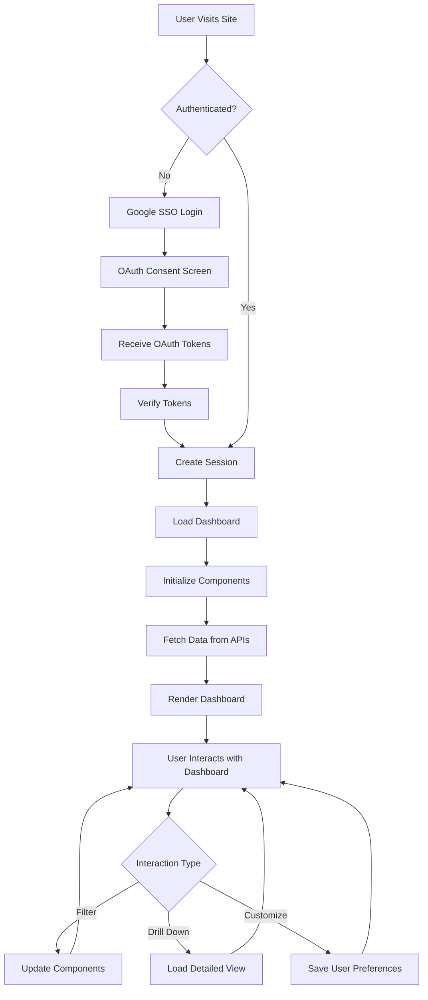

# Customer Data Platform (CDP) Application Design Document

## Page 1: Project Overview and Authentication

### Project Name and Heading

# CustomerInsight360

*Unifying customer data for actionable insights and personalized experiences*

### Google SSO Authentication

The CDP application will implement Google Single Sign-On (SSO) authentication using the @react-oauth/google library. This process will ensure secure and seamless access for authorized users.

Authentication Flow:
1. User clicks "Sign in with Google" button on the login page
2. Google OAuth consent screen appears
3. User grants permission
4. Application receives OAuth tokens
5. Backend verifies tokens and creates a session
6. User is redirected to the main dashboard

Implementation Details:
- Use GoogleLogin component from @react-oauth/google
- Configure OAuth 2.0 client ID in Google Cloud Console
- Implement token verification on the backend
- Handle error scenarios (e.g., network issues, invalid tokens)
- Design a clean, minimalist login interface with Google brand guidelines

Error Handling:
- Display user-friendly error messages
- Provide option to retry authentication
- Log detailed errors for debugging

Security Considerations:
- Use HTTPS for all communications
- Implement proper token storage and management
- Regular security audits and updates

Login Interface Design:
- Centered login form with CDP logo
- "Sign in with Google" button prominently displayed
- Empty input fields for email and password (for future non-SSO options)
- Clear error message area below the form

## Page 2: Dashboard Design and Components

### Dashboard Layout and Structure

The CDP dashboard will utilize a responsive 12-column grid system to ensure optimal layout across various screen sizes. The layout will consist of the following elements:

1. Header (1 row, 12 columns):
   - Logo (2 columns)
   - Navigation menu (8 columns)
   - User profile and settings (2 columns)

2. Sidebar (12 rows, 2 columns):
   - Main menu items
   - Collapsible for mobile view

3. Main Content Area (12 rows, 10 columns):
   - Flexible grid for dashboard components
   - Responsive breakpoints for tablet and mobile views

4. Footer (1 row, 12 columns):
   - Copyright information
   - Quick links

The navigation design will include:
- Main menu in the sidebar with icons and labels
- Sub-navigation as dropdown menus or tabs within each section
- Breadcrumb navigation for deep-linked pages

Screen real estate allocation:
- KPIs: 2 rows, 12 columns (4 KPIs, 3 columns each)
- Charts and graphs: 8 rows, 12 columns (2 columns for smaller charts, 4-6 columns for larger visualizations)
- Tables and detailed data: 4 rows, 12 columns

### Key Dashboard Components and API Mapping

#### a. Key Performance Indicators (KPIs)

Visual Description: Four card-style components, each displaying a single KPI with a large number, descriptive label, and trend indicator.

Data Visualization: Large typography for the main metric, with a small arrow icon indicating trend.

Interactivity: Hover effect to show percentage change, click to drill down into detailed view.

Data Update: Real-time updates with subtle fade-in animation.

CDP Schema Fields:
- total_purchases
- total_spend
- avg_satisfaction_score
- customer_lifetime_value

API Endpoint: `/kpis`

```json
{
  "total_customers": 10000,
  "total_revenue": 1500000,
  "avg_satisfaction": 4.2,
  "avg_clv": 2500
}
```

#### b. Customer Segment Distribution (Pie Chart)

Visual Description: Interactive pie chart showing the distribution of customers across segments.

Data Visualization: Pie chart with color-coded segments and labels.

Interactivity: Hover to highlight segment and show percentage, click to filter dashboard by segment.

Data Update: Daily updates with smooth transition animation.

CDP Schema Fields:
- customer_segment

API Endpoint: `/customer_segments`

```json
{
  "segments": [
    {"name": "High Value", "count": 2000},
    {"name": "Medium Value", "count": 5000},
    {"name": "Low Value", "count": 3000}
  ]
}
```

#### c. Monthly Revenue Trend (Line Chart)

Visual Description: Line chart showing revenue trends over the past 12 months.

Data Visualization: Multi-line chart with option to toggle between total revenue and average order value.

Interactivity: Hover for tooltips with detailed monthly data, zoom and pan functionality.

Data Update: Monthly updates with animation for new data points.

CDP Schema Fields:
- total_spend
- avg_purchase_value

API Endpoint: `/monthly_revenue`

```json
{
  "months": ["Jan", "Feb", "Mar", ...],
  "total_revenue": [100000, 120000, 110000, ...],
  "avg_order_value": [200, 220, 210, ...]
}
```

#### d. Top 5 Customers by Lifetime Value (Table)

Visual Description: Compact table listing top 5 customers with key metrics.

Data Visualization: Sortable table with customer name, lifetime value, total purchases, and last purchase date.

Interactivity: Click on customer name to view detailed profile, sort by columns.

Data Update: Daily updates with highlight animation for changed values.

CDP Schema Fields:
- customer_id
- first_name
- last_name
- customer_lifetime_value
- total_purchases
- last_purchase_date

API Endpoint: `/top_customers`

```json
{
  "top_customers": [
    {
      "id": 1001,
      "name": "John Doe",
      "lifetime_value": 10000,
      "total_purchases": 50,
      "last_purchase": "2023-05-15"
    },
    // ... more customers
  ]
}
```

#### e. Product Category Performance (Bar Chart)

Visual Description: Horizontal bar chart showing performance of product categories.

Data Visualization: Stacked bar chart with revenue and number of purchases per category.

Interactivity: Hover for detailed metrics, click to filter dashboard by category.

Data Update: Weekly updates with growing/shrinking animation for bars.

CDP Schema Fields:
- favorite_category
- total_spend

API Endpoint: `/product_category_performance`

```json
{
  "categories": [
    {
      "name": "Electronics",
      "revenue": 500000,
      "purchases": 2500
    },
    // ... more categories
  ]
}
```

#### f. Customer Satisfaction Score (Gauge Chart)

Visual Description: Semicircular gauge chart displaying overall customer satisfaction.

Data Visualization: Gauge with color-coded zones (red, yellow, green) and a needle pointing to the current score.

Interactivity: Hover to show exact score and benchmark comparisons.

Data Update: Real-time updates with smooth needle animation.

CDP Schema Fields:
- avg_satisfaction_score

API Endpoint: `/customer_satisfaction`

```json
{
  "current_score": 4.2,
  "previous_score": 4.0,
  "benchmark": 4.1
}
```

#### g. Churn Risk Distribution (Pie Chart)

Visual Description: Pie chart showing the distribution of customers across churn risk categories.

Data Visualization: Pie chart with color-coded segments (green for low risk, yellow for medium, red for high).

Interactivity: Hover to show number and percentage of customers in each risk category, click to filter dashboard.

Data Update: Daily updates with smooth transition animation.

CDP Schema Fields:
- churn_risk

API Endpoint: `/churn_risk`

```json
{
  "risk_categories": [
    {"name": "Low Risk", "count": 6000},
    {"name": "Medium Risk", "count": 3000},
    {"name": "High Risk", "count": 1000}
  ]
}
```

#### h. RFM Segmentation (Scatter Plot)

Visual Description: 3D scatter plot representing customers based on Recency, Frequency, and Monetary value.

Data Visualization: Interactive 3D plot with axes for R, F, and M values, color-coded points representing customers.

Interactivity: Zoom, rotate, and pan the 3D space. Hover over points for customer details, click to view full profile.

Data Update: Weekly updates with animation for point movements.

CDP Schema Fields:
- days_since_last_purchase (Recency)
- total_purchases (Frequency)
- total_spend (Monetary)

API Endpoint: `/rfm_segmentation`

```json
{
  "customers": [
    {
      "id": 1001,
      "recency": 5,
      "frequency": 20,
      "monetary": 5000
    },
    // ... more customers
  ]
}
```

### Dashboard Interactivity and User Experience

Global Filtering:
- Date range selector affecting all components
- Customer segment filter
- Product category filter
- Search bar for finding specific customers or products

Cross-component Data Linking:
- Clicking on a segment in the Customer Segment Distribution chart filters all other components
- Selecting a product category in the Product Category Performance chart updates customer lists and revenue trends

Customization Options:
- Drag-and-drop interface for rearranging dashboard components
- Option to hide/show specific components
- Ability to save custom dashboard layouts
- Customizable color themes for charts and UI

## Page 3: Architecture Visualization and Technical Considerations

### Sankey Diagram Implementation using plotly

The Sankey diagram provided represents the data flow in our CDP application, from source tables to the final customer_360 table. Here's how to implement and interact with it using plotly:

1. Data Preparation:
   - Convert the provided JSON structure into a format compatible with plotly's Sankey diagram.
   - Create separate arrays for nodes and links.

2. Plotly Implementation:
```javascript
import Plot from 'react-plotly.js';

const SankeyDiagram = () => {
  const data = [{
    type: "sankey",
    orientation: "h",
    node: {
      pad: 15,
      thickness: 30,
      line: { color: "black", width: 0.5 },
      label: ["customer_info", "product_catalog", ...],
      color: ["#a6cee3", "#1f78b4", ...]
    },
    link: {
      source: [0, 2, 2, 1, 3, 5, 4, 6, 7, 8, 9, 10, 11, 12],
      target: [7, 8, 9, 9, 10, 11, 11, 12, 13, 13, 13, 13, 13, 13],
      value: [1, 1, 1, 1, 1, 1, 1, 1, 1, 1, 1, 1, 1, 1]
    }
  }];

  const layout = {
    title: "CDP Data Flow",
    font: { size: 10 }
  };

  return <Plot data={data} layout={layout} />;
};
```

3. Styling:
   - Use a color palette that distinguishes between source tables, temporary tables, and the final customer_360 table.
   - Adjust node padding and thickness for optimal visibility.

4. Interactivity:
   - Implement hover effects to show detailed information about each node and link.
   - Add click events to highlight specific data flows.

5. Responsiveness:
   - Ensure the diagram resizes appropriately for different screen sizes.
   - Implement a zoom feature for detailed exploration on smaller screens.

### Data Integration and Performance

1. Sample Data Generation:
   - Create a script to generate sample data that fits the CDP schema.
   - Ensure generated data covers all possible scenarios and edge cases.

2. Efficient Data Loading:
   - Implement lazy loading for dashboard components.
   - Use pagination for large datasets (e.g., customer lists).
   - Implement virtual scrolling for long lists to improve performance.

3. State Management:
   - Use Redux for global state management.
   - Implement Redux Toolkit for simplified Redux logic.

4. Caching Mechanisms:
   - Use React Query for server state management and caching.
   - Implement service workers for offline support and faster subsequent loads.

5. Update Strategies:
   - Use websockets for real-time updates on critical metrics.
   - Implement polling for less time-sensitive data.

6. Error Handling:
   - Create fallback UI components for failed data fetches.
   - Implement retry mechanisms for failed API calls.
   - Display user-friendly error messages with options to refresh or contact support.

### Responsive Design and Cross-platform Considerations

1. Breakpoints:
   - Desktop: 1200px and above
   - Tablet: 768px to 1199px
   - Mobile: Below 768px

2. Layout Adjustments:
   - Desktop: Full dashboard layout with sidebar
   - Tablet: Collapsible sidebar, reorganized chart layout
   - Mobile: Full-width components, vertically stacked

3. Progressive Enhancement:
   - Implement core functionality for all devices
   - Add advanced interactive features for devices with higher capabilities
   - Use feature detection to provide optimal experience across different browsers and devices

4. Touch Optimization:
   - Increase touch target sizes for mobile devices
   - Implement swipe gestures for navigation on touch devices

5. Performance Optimization:
   - Use code splitting to reduce initial load time
   - Optimize images and assets for different device capabilities

## Page 4: Website Flow and API Integration

### Website Flow



### API Integration

The dashboard integrates with backend APIs using the following endpoints:

1. `/kpis`: Fetches key performance indicators
2. `/customer_segments`: Retrieves customer segment distribution
3. `/monthly_revenue`: Gets monthly revenue trend data
4. `/top_customers`: Fetches top 5 customers by lifetime value
5. `/product_category_performance`: Retrieves product category performance data
6. `/customer_satisfaction`: Gets overall customer satisfaction score
7. `/churn_risk`: Fetches churn risk distribution data
8. `/rfm_segmentation`: Retrieves RFM segmentation data for scatter plot

Data Fetching Process:
1. On dashboard initialization, make parallel API calls to all endpoints
2. Use React Query for efficient data fetching and caching
3. Implement loading states for each component while data is being fetched
4. Handle API errors gracefully with error boundaries and retry mechanisms

API Response Handling:
1. Validate API responses against expected schema
2. Transform data as needed for each visualization component
3. Update global state with new data
4. Trigger re-renders of affected components

Error Cases:
1. Network errors: Implement exponential backoff for retries
2. Data format errors: Log error, display fallback UI, and notify developers
3. Authorization errors: Redirect to login page if session has expired

### Data Refresh and Real-time Updates

1. Implement websocket connection for real-time updates on critical metrics (e.g., KPIs, satisfaction score)
2. Use polling for less time-sensitive data:
   - Customer segments: Daily updates
   - Revenue trends: Hourly updates
   - Product performance: Daily updates
3. Implement a "Refresh" button for manual data updates
4. Use React Query's built-in refetching capabilities for automatic background updates
5. Implement optimistic UI updates for immediate feedback on user actions

By following this comprehensive design document, UI developers will have a clear roadmap for building a robust, user-friendly, and data-rich CDP application that fully utilizes the provided schema and meets the complex data visualization needs of the project.

# Customer Compass 360 Backend API Documentation

## Overview

This document provides detailed information about the backend API for the Customer Compass 360 application. The API is built using FastAPI and provides various endpoints to retrieve customer data, performance metrics, and visualizations.

## Base URL

The base URL for all API endpoints will depend on your deployment environment. Replace `{BASE_URL}` in the endpoint URLs with the appropriate base URL for your deployment.

## Authentication

Currently, the API does not implement authentication. If required, authentication mechanisms should be added before deploying to a production environment.

## Endpoints

### 1. Root

- **URL:** `{BASE_URL}/`
- **Method:** GET
- **Description:** Provides a welcome message for the API.
- **Response:**
  ```json
  {
    "message": "Welcome to the CDP Dashboard API"
  }
  ```

### 2. Key Performance Indicators (KPIs)

- **URL:** `{BASE_URL}/kpis`
- **Method:** GET
- **Description:** Retrieves key performance indicators for the business.
- **Response:** JSON object containing:
  - `total_customers`: Integer representing the total number of customers
  - `total_lifetime_value`: Float representing the total lifetime value of all customers
  - `average_order_value`: Float representing the average order value of all customers
  - `retention_rate`: Float representing the retention rate of all customers (percentage)
- **Example Response:**
  ```json
  {
    "total_customers": 10000,
    "total_lifetime_value": 5000000.50,
    "average_order_value": 150.75,
    "retention_rate": 85.5
  }
  ```

### 3. Customer Segments

- **URL:** `{BASE_URL}/customer_segments`
- **Method:** GET
- **Description:** Retrieves customer segment distribution data.
- **Response:** JSON object representing a pie chart of customer segment distribution.
- **Note:** The response is a Plotly figure JSON that can be used to render a chart on the frontend.

### 4. Monthly Revenue

- **URL:** `{BASE_URL}/monthly_revenue`
- **Method:** GET
- **Description:** Retrieves monthly revenue trend data.
- **Response:** JSON object representing a line chart of monthly revenue trend.
- **Note:** The response is a Plotly figure JSON that can be used to render a chart on the frontend.

### 5. Top Customers

- **URL:** `{BASE_URL}/top_customers`
- **Method:** GET
- **Description:** Retrieves the top 5 customers by total lifetime value.
- **Response:** JSON array of objects, each containing:
  - `customer_id`: String representing the customer's unique identifier
  - `first_name`: String representing the customer's first name
  - `last_name`: String representing the customer's last name
  - `total_lifetime_value`: Float representing the customer's total lifetime value
- **Example Response:**
  ```json
  [
    {
      "customer_id": "C001",
      "first_name": "John",
      "last_name": "Doe",
      "total_lifetime_value": 25000.50
    },
    {
      "customer_id": "C002",
      "first_name": "Jane",
      "last_name": "Smith",
      "total_lifetime_value": 22000.75
    }
  ]
  ```

### 6. Product Category Performance

- **URL:** `{BASE_URL}/product_category_performance`
- **Method:** GET
- **Description:** Retrieves revenue performance data for different product categories.
- **Response:** JSON object representing a bar chart of product category performance.
- **Note:** The response is a Plotly figure JSON that can be used to render a chart on the frontend.

### 7. Customer Satisfaction

- **URL:** `{BASE_URL}/customer_satisfaction`
- **Method:** GET
- **Description:** Retrieves the average customer satisfaction score.
- **Response:** JSON object representing a gauge chart of customer satisfaction score.
- **Note:** The response is a Plotly figure JSON that can be used to render a chart on the frontend.

### 8. Churn Risk

- **URL:** `{BASE_URL}/churn_risk`
- **Method:** GET
- **Description:** Retrieves the distribution of churn risk scores.
- **Response:** JSON object representing a pie chart of churn risk distribution.
- **Note:** The response is a Plotly figure JSON that can be used to render a chart on the frontend.

### 9. RFM Segmentation

- **URL:** `{BASE_URL}/rfm_segmentation`
- **Method:** GET
- **Description:** Retrieves RFM (Recency, Frequency, Monetary) segmentation data.
- **Response:** JSON object representing a 3D scatter plot of RFM segmentation.
- **Note:** The response is a Plotly figure JSON that can be used to render a chart on the frontend.

## Error Handling

All endpoints will return appropriate HTTP status codes:
- 200: Successful request
- 4xx: Client errors (e.g., 404 for not found, 400 for bad request)
- 5xx: Server errors

In case of errors, a JSON object with an "error" key describing the issue will be returned.

Example error response:
```json
{
  "error": "Resource not found"
}
```

## Data Format

All responses are in JSON format. For endpoints returning chart data (customer segments, monthly revenue, product category performance, customer satisfaction, churn risk, and RFM segmentation), the response is a JSON representation of a Plotly figure, which can be directly used to render charts on the frontend.

## Database

The API interacts with an SQLite database named `pg_cdp_demo.db`. This database contains the following tables:
- `customer_360`: Contains comprehensive customer data
- `purchase_transactions`: Contains data about customer purchases
- `product_catalog`: Contains information about products

## Dependencies

The backend relies on the following main Python libraries:
- FastAPI: Web framework for building the API
- SQLite3: Database interaction
- Pandas: Data manipulation and analysis
- Plotly: Generating interactive charts
- Anthropic: For potential AI-powered features (API key required)

## Running the API

To run the API locally:

1. Ensure all dependencies are installed:
   ```
   pip install fastapi uvicorn sqlite3 pandas plotly
   ```

2. Run the FastAPI application using Uvicorn:
   ```
   uvicorn main:app --host 0.0.0.0 --port 8000
   ```

The API will be available at `http://localhost:8000`. You can access the interactive API documentation at `http://localhost:8000/docs`.

## Deployment

For production deployment, consider the following:
- Use a production-grade ASGI server like Gunicorn with Uvicorn workers
- Implement proper authentication and authorization mechanisms
- Use environment variables for sensitive information (e.g., database credentials)
- Consider using a production-ready database system (e.g., PostgreSQL)
- Implement HTTPS for secure communication
- Set up proper logging and monitoring

## Conclusion

This API provides a comprehensive set of endpoints to retrieve various customer and business metrics for the Customer Compass 360 application. It's designed to be easily integrated with a frontend application to create a full-featured customer data platform dashboard.