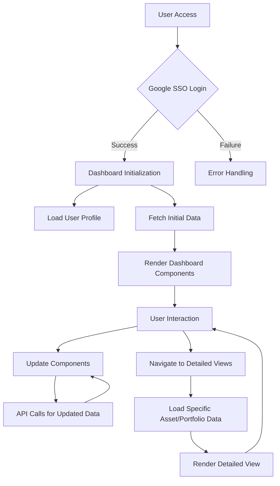

###  4: Website Flow and API Integration

### 1. Website Flow

### 2. API Integration

The dashboard integrates with backend APIs as follows:

1. **KPIs**: `/kpis`
   - Fetches overall portfolio performance metrics
   - Used in: Header summary, Performance overview widget

2. **Portfolio Overview**: `/api/get_portfolio_overview`
   - Retrieves high-level portfolio composition
   - Used in: Asset Allocation chart, Risk Distribution chart

3. **Asset Allocation**: `/api/get_asset_allocation`
   - Provides detailed breakdown of assets by type
   - Used in: Asset Allocation pie chart

4. **Risk Metrics**: `/api/get_risk_metrics`
   - Fetches risk-related data for assets
   - Used in: Risk Metrics table, Risk Distribution chart

5. **Performance Dashboard**: `/api/get_performance_dashboard`
   - Retrieves performance data for top-performing assets
   - Used in: Top Performers table

6. **Compliance Summary**: `/api/get_compliance_summary`
   - Fetches compliance status for assets
   - Used in: Compliance Summary table

7. **Transaction Analysis**: `/api/get_transaction_analysis`
   - Provides transaction volume data
   - Used in: Monthly Transaction Volume chart

8. **Sector Exposure**: `/api/get_sector_exposure`
   - Retrieves data on sector-wise asset distribution
   - Used in: Sector Exposure bar chart

9. **Geographic Distribution**: `/api/get_geographic_distribution`
   - Fetches data on asset distribution by country
   - Used in: Geographic Distribution choropleth map

### 3. Data Refresh and Real-time Updates

1. **Polling Strategy:**
   - Implement polling for non-critical data (e.g., compliance summary) every 5 minutes
   - Use exponential backoff for failed requests

2. **WebSocket Integration:**
   - Establish WebSocket connection for real-time updates on market data and risk metrics
   - Implement reconnection logic with exponential backoff

3. **Optimistic Updates:**
   - Apply immediate UI updates for user actions (e.g., portfolio changes)
   - Reconcile with server response to ensure data consistency

4. **Caching Strategy:**
   - Implement client-side caching using IndexedDB for offline support
   - Use service workers to manage cache and provide offline functionality

5. **Lazy Loading:**
   - Implement lazy loading for components not in the initial viewport
   - Use intersection observer API to trigger data loading as components come into view

By implementing these strategies, the Asset 360 platform ensures efficient data management, real-time updates, and optimal performance, providing users with a responsive and data-rich experience for comprehensive asset management.

# Cloud-Based Application Architecture

## Overview

This architecture describes a modern, cloud-based application utilizing various Google Cloud Platform (GCP) services for scalability, security, and efficient data processing.

### Components

#### Client-Facing Layer

1. Client: The end-user interface
2. Cloud Armor: Provides web application firewall and DDoS protection
3. Cloud Load Balancer: Distributes incoming traffic and performs SSL termination
4. Cloud CDN: Content Delivery Network for faster content delivery

#### Compute Layer

1. App Engine (Frontend): Hosts the React + Vite frontend application
2. Cloud Run (Backend API): Runs the backend API using Gunicorn + Uvicorn

#### Data Storage Layer

1. Cloud SQL (PostgreSQL): Relational database for structured data
2. Cloud Firestore: NoSQL database for flexible, scalable data storage

#### Data Processing Layer

1. Pub/Sub: Messaging service for event-driven systems
2. Cloud Functions: Serverless compute for event-driven processing
3. BigQuery: Data warehouse for analytics and large-scale data processing

#### Security & Configuration Layer

1. Secret Manager: Securely stores and manages sensitive information
2. Identity Platform: Manages user authentication and identity
3. Cloud KMS: Key Management Service for cryptographic operations
4. VPC Network: Virtual Private Cloud network containing various services

#### Monitoring & Scheduling

1. Cloud Operations: Provides monitoring and logging for various components
2. Cloud Scheduler: Manages scheduled tasks and jobs

#### Data Flow

1. Client requests are first processed by Cloud Armor for security.
2. Requests then pass through the Cloud Load Balancer, which terminates SSL.
3. Cloud CDN serves cached content when possible.
4. Requests are routed to either App Engine (frontend) or Cloud Run (backend API).
5. The backend API interacts with Cloud SQL, Firestore, and Pub/Sub as needed.
6. Pub/Sub triggers Cloud Functions for event-driven processing.
7. Cloud Functions can interact with BigQuery for data analytics.

#### Security Measures

1. HTTPS is used for all external communications.
2. SSL/TLS is used for internal service communications.
3. Secret Manager securely stores sensitive information.
4. Identity Platform manages user authentication.
5. Cloud KMS is used for key management.
6. All services are contained within a VPC Network for additional security.

#### Monitoring and Management
1. Cloud Operations provides monitoring and logging capabilities for most components in the architecture, ensuring visibility into the system's performance and health.

#### Scalability and Performance

1. Cloud Load Balancer and Cloud CDN ensure efficient distribution of traffic and content.
2. App Engine and Cloud Run provide scalable compute resources.
3. Cloud SQL and Firestore offer scalable data storage solutions.
Pub/Sub and Cloud Functions allow for scalable, event-driven processing.

This architecture provides a robust, secure, and scalable foundation for modern cloud-based applications, leveraging various GCP services to meet diverse requirements.

